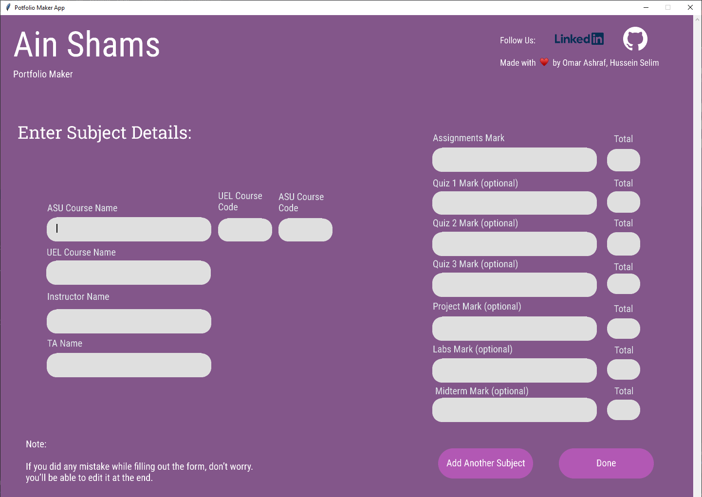

### Hi there, It's Omar Ashraf👋
### and contributor: Hussein Selim 👋

## We are currently Engineering Students at Ain Shams University in Egypt!!

- 🔭 I can work with all languages (python, c++, c, java, etc...)
- 🌱 I’m currently learning machine learning 
- 👯 I’m looking to collaborate with other software developers
- 🥅 2020 Goals: Contribute more to Open Source projects

I developed this software to fix the hard time students have, just to make their Portfolio for each subject
including all (assignments, quizzes, etc...). And came up with the portfolio-maker software which take care of you 
and does everything from downloading your files automatically from the LMS to creating your full portfolio with your 
templates and documents all filled and ready to deliver with just few clicks !
### Connect with me:

[][linkedin_omar]
[][instagram_omar]
[][github_omar]
 

### Connect with Hussein:

[][linkedin_hussein]
[][instagram_hussein]
[][github_hussein]
 
 

---

### 📕 Portfolio Maker guide 😃

<!-- BLOG-POST-LIST:START -->
- **Step 1**: open your application and wait for this window []
- **Step 2**: Fill all the fields with your correct information...
   **Note: Incorrect username or password will result in errors while trying to connect 
 to the LMS so make sure to right the correct info! Don't worry if you filled anything else wrong you could always edit your portfolio after you have finished.**
- **Step 3**: Now here as shown below you will be asked to enter all the information regarding your first subject 
 and after finishing click either add another subject or done to go the following step 
- **Step 4**: 
<!-- BLOG-POST-LIST:END -->

---

  
:zap: Recent GitHub Activity

  
<!--START_SECTION:activity-->
1. 🗣 Commented on [#2](https://github.com/codeSTACKr/portfolio-sass/issues/2) in [codeSTACKr/portfolio-sass](https://github.com/codeSTACKr/portfolio-sass)
2. ❗️ Closed issue [#2](https://github.com/codeSTACKr/portfolio-sass/issues/2) in [codeSTACKr/portfolio-sass](https://github.com/codeSTACKr/portfolio-sass)
3. ❌ Closed PR [#11](https://github.com/codeSTACKr/free-developer-resources/pull/11) in [codeSTACKr/free-developer-resources](https://github.com/codeSTACKr/free-developer-resources)
4. 🗣 Commented on [#11](https://github.com/codeSTACKr/free-developer-resources/issues/11) in [codeSTACKr/free-developer-resources](https://github.com/codeSTACKr/free-developer-resources)
5. 🎉 Merged PR [#10](https://github.com/codeSTACKr/free-developer-resources/pull/10) in [codeSTACKr/free-developer-resources](https://github.com/codeSTACKr/free-developer-resources)
<!--END_SECTION:activity-->

  
:zap: GitHub Stats

  

[instagram_omar]: https://instagram.com/codeSTACKr
[instagram_hussein]: https://www.instagram.com/husseinaselim/
[linkedin_omar]: https://www.linkedin.com/in/omaco2211/
[linkedin_hussein]: https://www.linkedin.com/in/hussein-selim-6190521a0/
[facebook_omar]: https://www.facebook.com/omar.ashraf.7946?_rdc=1&_rdr
[facebook_hussein]: https://www.facebook.com/profile.php?id=100009406842928
[github_omar]: https://github.com/SpadeQ22
[github_hussein]: https://github.com/Hussein-Selim
